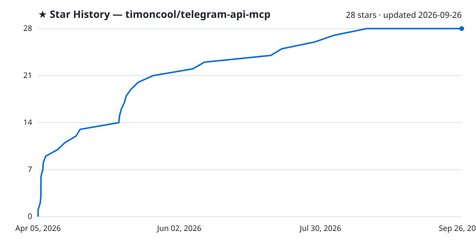

<div align="center">

# telegram-api-mcp

**Ultimate MCP server for Telegram Bot API — 185 methods, full v10.2 coverage, rich messages, meta-mode, rate limiting, circuit breaker.**

[](https://github.com/timoncool/telegram-api-mcp/stargazers)
[](https://www.npmjs.com/package/telegram-api-mcp)
[](LICENSE)
[](https://core.telegram.org/bots/api)
[](https://github.com/timoncool/trail-spec)

</div>

185/185 Bot API methods with Zod validation, token masking, tool annotations, and zero bloat (2 dependencies).

## Features

- **185/185 Bot API methods** — messages, media, polls, chats, forums, stickers, payments, business, stories, gifts, games, inline, managed bots
- **Rich messages** — post up to 32768 characters with headings, tables, lists, collages, slideshows, footnotes and up to 50 inline media, instead of the 1024-character caption ceiling
- **Bot API 10.2** (July 2026) — rich messages, ephemeral messages, live photos, guest mode, join-request queries, poll media
- **`telegram_format` tool** — the server explains the exact shape of `rich_message`, `media`, `reply_markup`, `poll` and more *before* you send, so an agent never has to guess the syntax (also exposed as MCP resources under `telegram://format/…`)
- **Meta-mode** — 2 tools instead of 185, saves ~99% context tokens
- **Rate limiting** — global (30 req/sec) + per-chat (20 msg/min), token bucket with async mutex
- **Circuit breaker** — 3-state (closed/open/half-open), auto-recovery
- **Retry with backoff** — respects Telegram 429 `retry_after`, exponential backoff on 5xx
- **Zod validation** — every parameter validated before hitting Telegram API
- **Token masking** — bot token never appears in responses, logs, or error messages
- **File upload security** — path traversal protection, configurable allowed directories
- **Tool annotations** — all 185 methods annotated (readOnly, destructive, idempotent, openWorld)
- **Docs mirror + audit** — `npm run docs:refresh` re-downloads the official spec, `npm run audit` fails if any method or parameter drifts from it
- **Response truncation** — 100K char limit to prevent context overflow
- **Zero bloat** — only 2 dependencies: `@modelcontextprotocol/sdk` + `zod`

## Quick Start

### Claude Code

```bash
claude mcp add telegram -- npx telegram-api-mcp -e TELEGRAM_BOT_TOKEN=your_token
```

With meta-mode (recommended for large conversations):

```bash
claude mcp add telegram -- npx telegram-api-mcp \
  -e TELEGRAM_BOT_TOKEN=your_token \
  -e TELEGRAM_META_MODE=true
```

### Claude Desktop

Add to `claude_desktop_config.json`:

```json
{
  "mcpServers": {
    "telegram": {
      "command": "npx",
      "args": ["telegram-api-mcp"],
      "env": {
        "TELEGRAM_BOT_TOKEN": "your_token_from_botfather"
      }
    }
  }
}
```

### With default chat (skip chat_id in every call)

```json
{
  "mcpServers": {
    "telegram": {
      "command": "npx",
      "args": ["telegram-api-mcp"],
      "env": {
        "TELEGRAM_BOT_TOKEN": "your_token",
        "TELEGRAM_DEFAULT_CHAT_ID": "-1001234567890"
      }
    }
  }
}
```

### From source

```bash
git clone https://github.com/timoncool/telegram-api-mcp.git
cd telegram-api-mcp
npm install && npm run build
TELEGRAM_BOT_TOKEN=your_token node dist/index.js
```

## Environment Variables

| Variable | Required | Default | Description |
|----------|:---:|:---:|-------------|
| `TELEGRAM_BOT_TOKEN` | **Yes** | — | Bot token from [@BotFather](https://t.me/BotFather) |
| `TELEGRAM_DEFAULT_CHAT_ID` | No | — | Default chat ID for all tools |
| `TELEGRAM_DEFAULT_THREAD_ID` | No | — | Default forum topic thread ID |
| `TELEGRAM_META_MODE` | No | `false` | Use 2 meta-tools instead of 185 |
| `TELEGRAM_GLOBAL_RATE_LIMIT` | No | `30` | Max requests/sec ([Telegram limit](https://core.telegram.org/bots/faq#my-bot-is-hitting-limits)) |
| `TELEGRAM_PER_CHAT_RATE_LIMIT` | No | `20` | Max messages/min per group ([Telegram limit](https://core.telegram.org/bots/faq#my-bot-is-hitting-limits)) |
| `TELEGRAM_MAX_RETRIES` | No | `3` | Retry attempts on transient errors |
| `TELEGRAM_CB_THRESHOLD` | No | `5` | Failures before circuit opens |
| `TELEGRAM_CB_COOLDOWN` | No | `30000` | Circuit breaker cooldown (ms) |
| `TELEGRAM_ALLOWED_UPLOAD_DIRS` | No | — | Comma-separated allowed upload paths |
| `TELEGRAM_MAX_FILE_SIZE` | No | `52428800` | Max upload file size (50MB) |

## Meta Mode

When `TELEGRAM_META_MODE=true`, the server exposes only 2 tools instead of 185:

- **`telegram_find`** — search methods by keyword or category
- **`telegram_call`** — call any method by name with JSON params

This saves ~99% of context tokens while keeping full API access:

```
User: "Post a poll in my channel"
AI: → telegram_find(query: "poll")
AI: → telegram_call(method: "sendPoll", params: { chat_id: ..., question: "...", options: [...] })
```

## API Coverage

185/185 methods — **100% Bot API 10.2** (July 2026)

| Category | Count | Key methods |
|----------|:---:|-------------|
| Bot | 21 | getMe, setMyCommands, setMyProfilePhoto, getFile, getUserProfilePhotos |
| Chat | 18 | getChat, setChatTitle, pinChatMessage, answerChatJoinRequestQuery, getUserPersonalChatMessages |
| Stickers | 16 | sendSticker, createNewStickerSet, uploadStickerFile, setStickerKeywords |
| Editing | 15 | editMessageText, editMessageMedia, deleteMessage, editEphemeralMessageText, deleteEphemeralMessage |
| Business | 14 | readBusinessMessage, setBusinessAccountName, getBusinessAccountGifts, approveSuggestedPost |
| Messages | 13 | sendMessage, sendRichMessage, sendRichMessageDraft, sendChecklist, deleteMessageReaction |
| Forum | 13 | createForumTopic, editForumTopic, closeForumTopic, deleteForumTopic |
| Media | 10 | sendPhoto, sendVideo, sendLivePhoto, sendMediaGroup, sendPaidMedia |
| Members | 9 | banChatMember, promoteChatMember, setChatMemberTag, restrictChatMember |
| Invite | 8 | createChatInviteLink, createChatSubscriptionInviteLink, approveChatJoinRequest |
| Payments | 8 | sendInvoice, createInvoiceLink, getStarTransactions, getMyStarBalance |
| Gifts | 8 | sendGift, getUserGifts, getChatGifts, giftPremiumSubscription, upgradeGift |
| Inline | 5 | answerInlineQuery, answerCallbackQuery, answerGuestQuery, answerWebAppQuery |
| Managed Bots | 5 | getManagedBotToken, getManagedBotAccessSettings, setManagedBotAccessSettings |
| Other | 5 | verifyUser, verifyChat, setUserEmojiStatus, savePreparedInlineMessage |
| Forwarding | 4 | forwardMessage, forwardMessages, copyMessage, copyMessages |
| Stories | 4 | postStory, editStory, deleteStory, repostStory |
| Updates | 4 | getUpdates, setWebhook, deleteWebhook, getWebhookInfo |
| Games | 3 | sendGame, setGameScore, getGameHighScores |
| Polls | 1 | sendPoll (revoting, shuffle, media, country restrictions) |
| Passport | 1 | setPassportDataErrors |

## Long posts: rich messages

`send_photo` and friends cap the caption at **1024 characters** — that limit is set by Telegram and still applies. To publish a real post, use `send_rich_message` instead:

```json
{
  "chat_id": "@mychannel",
  "rich_message": {
    "markdown": "# Heading

Paragraph with **bold** and a [link](https://t.me).


| Model | Speed |
|:------|------:|
| A | **42** |

> Block quote

- List item
- Another item"
  }
}
```

Not sure of the syntax? Ask the server — it ships the reference:

```
telegram_format(topic: "rich_message")
```

`telegram_format` also answers for `caption`, `media`, `reply_markup`, `poll`, `checklist`, `reply_parameters`, `link_preview_options` and `suggested_post_parameters`, by topic, by tool name (`send_media_group`), or in plain wording (`"long post"`, `"album"`, `"buttons"`). The same docs are served as MCP resources at `telegram://format/<topic>`.

Pass exactly one of `markdown` (GitHub-flavored, plus Telegram tags), `html`, or `blocks`. Limits enforced before the request leaves the server:

| Limit | Value |
|-------|:---:|
| Text | 32768 characters |
| Blocks (nested included) | 500 |
| Media attachments | 50 |
| Table columns | 20 |
| Nesting levels | 16 |

Media inside `markdown`/`html` must be HTTP(S) URLs and sit in their own block. `send_rich_message_draft` streams a partial message as a 30-second preview while it is still being generated — finish with `send_rich_message` to persist it.

## Architecture

```
src/
├── index.ts              # Entry point
├── config.ts             # Environment config with validation
├── server.ts             # MCP server (standard + meta mode)
├── telegram-client.ts    # HTTP client with retry, rate limit, circuit breaker
├── rate-limiter.ts       # Token bucket: global + per-chat
├── circuit-breaker.ts    # 3-state circuit breaker (closed/open/half-open)
├── method-registry.ts    # Declarative method definitions + Zod schema builder
├── formats.ts            # Reference for structured params, served by telegram_format
└── methods/
    ├── index.ts          # Aggregator + search
    ├── messages.ts       # sendMessage, sendDice, sendChecklist, ...
    ├── forwarding.ts     # forwardMessage, copyMessage, ...
    ├── editing.ts        # editMessageText, deleteMessage, ...
    ├── chat.ts           # getChat, setChatTitle, banChatMember, ...
    ├── bot.ts            # getMe, setMyCommands, getFile, ...
    ├── forum.ts          # createForumTopic, editForumTopic, ...
    ├── stickers.ts       # sendSticker, createNewStickerSet, ...
    ├── payments.ts       # sendInvoice, getStarTransactions, ...
    ├── business.ts       # readBusinessMessage, setBusinessAccount*, ...
    ├── stories.ts        # postStory, editStory, deleteStory, ...
    ├── gifts.ts          # sendGift, getUserGifts, convertGiftToStars, ...
    ├── games.ts          # sendGame, setGameScore, ...
    ├── inline.ts         # answerInlineQuery, answerCallbackQuery
    ├── managed-bots.ts   # getManagedBotToken, replaceManagedBotToken
    ├── updates.ts        # getUpdates, setWebhook, ...
    ├── passport.ts       # setPassportDataErrors
    └── other.ts          # verifyUser, setChatMenuButton, ...

scripts/
├── refresh-docs.mjs      # Re-download core.telegram.org/bots/* into docs/
└── audit-registry.mjs    # Diff src/methods against the docs mirror
```

### Design principles

- **Declarative registry** — each method is pure data (name, params, types, annotations). One generic handler serves all 185 methods. Adding a new method = one array entry.
- **Spec-checked** — `docs/` mirrors the official Bot API pages and `scripts/audit-registry.mjs` diffs the registry against it, so a new Telegram release surfaces as a failing check rather than a runtime 400.
- **Zod validation** — every parameter validated before reaching Telegram. Clear error messages with hints instead of opaque API 400s.
- **Token bucket rate limiting** — no race conditions (async mutex). Defaults match [Telegram's official limits](https://core.telegram.org/bots/faq#my-bot-is-hitting-limits): 30 req/sec global, 20 msg/min per group.
- **Circuit breaker** — 429 (rate limit) is NOT counted as failure. Only real errors (5xx, network) trip the breaker. Half-open probe recovers automatically.
- **Tool annotations** — every method has MCP annotations (readOnlyHint, destructiveHint, idempotentHint, openWorldHint) so AI clients know which tools are safe to auto-approve.
- **Response truncation** — responses capped at 100K chars to prevent context window overflow.

## Security

- Bot token never appears in MCP tool responses or error messages (masked as `***`)
- File upload paths validated against allowed directories (`TELEGRAM_ALLOWED_UPLOAD_DIRS`)
- Path traversal attacks blocked (resolve + normalize + separator check)
- No `eval()`, no `Function()`, no dynamic imports
- No external requests except `api.telegram.org`
- No telemetry, no analytics, no phone-home
- Zero bloat: only 2 runtime dependencies (`@modelcontextprotocol/sdk` + `zod`)

## Development

```bash
npm install
npm run build         # TypeScript compilation
npm run typecheck     # Type checking without emit
npm test              # Run all tests (vitest)
npm run test:watch    # Watch mode
npm run lint          # ESLint
npm run docs:refresh  # Re-download the official Bot API docs into docs/
npm run audit         # Diff the registry against the docs mirror
```

## Other Projects by [@timoncool](https://github.com/timoncool)

| Project | Description |
|---------|-------------|
| [civitai-mcp-ultimate](https://github.com/timoncool/civitai-mcp-ultimate) | Civitai API as MCP server |
| [trail-spec](https://github.com/timoncool/trail-spec) | TRAIL — cross-MCP content tracking protocol |
| [ACE-Step Studio](https://github.com/timoncool/ACE-Step-Studio) | AI music studio — songs, vocals, covers, videos |
| [VideoSOS](https://github.com/timoncool/videosos) | AI video production in the browser |
| [tg-challenge-bot](https://github.com/timoncool/tg-challenge-bot) | AI anti-spam bot for Telegram |
| [Bulka](https://github.com/timoncool/Bulka) | Live-coding music platform |

## Support the Author

I build open-source software and do AI research. Most of what I create is free and available to everyone. Your donations help me keep creating without worrying about where the next meal comes from =)

**[All donation methods](https://github.com/timoncool/ACE-Step-Studio/blob/master/DONATE.md)** | **[dalink.to/nerual_dreming](https://dalink.to/nerual_dreming)** | **[boosty.to/neuro_art](https://boosty.to/neuro_art)**

- **BTC:** `1E7dHL22RpyhJGVpcvKdbyZgksSYkYeEBC`
- **ETH (ERC20):** `0xb5db65adf478983186d4897ba92fe2c25c594a0c`
- **USDT (TRC20):** `TQST9Lp2TjK6FiVkn4fwfGUee7NmkxEE7C`


## Star History

<a href="https://github.com/timoncool/telegram-api-mcp/stargazers">
 <picture>
   <source media="(prefers-color-scheme: dark)" srcset="docs/stars-dark.svg" />
   <source media="(prefers-color-scheme: light)" srcset="docs/stars-light.svg" />
   
 </picture>
</a>

## License

MIT
